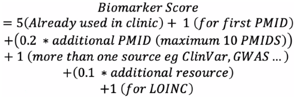

# Biomarker Score Calculator

The biomarker scoring system is meant for quick assessment of how much existing knowledge has already been collected for an entity. Although a default scoring is provided, we recognize that different users will have different use cases, and as a result, will have different views on how various parameters in the scoring should be weighted.

The scoring algorithm and default weights are as follows: 

## Weights/Parameters

The available parameters are: 

- `Clinical Use`: The score if a biomarker is already in use in a clinical application (default 5).
- `First PMID`: The score for if the biomarker has at least one PubMed paper associated with its evidence (default 1).
- `Other PMID`: The score for every additional PubMed paper (default 0.2).
- `PMID Limit`: The cap on PubMed papers (default 10). 
- `First Source`: The score for the first non-PubMed evidence source (default 1).
- `Other Source`: The score for additional sources (default 0.1).
- `Loinc`: The score for a Loinc code associated with the biomarker (default 1).
- `Generic Condition Penalty`: The score penalty for biomarkers with non-specific conditions such as generic Cancer. (default -4).

## Usage

The tool will look for data files with a glob pattern of `src/data/*.json` by default, however, the glob pattern can be overwritten by passing in a command-line argument with a glob pattern that will find the JSON data files. Once run, you will have the choice to overwrite the default weights or use the defaults. A result file named `score_outputs.json` will be created with the calculated score for each biomarker file found from the glob pattern.
